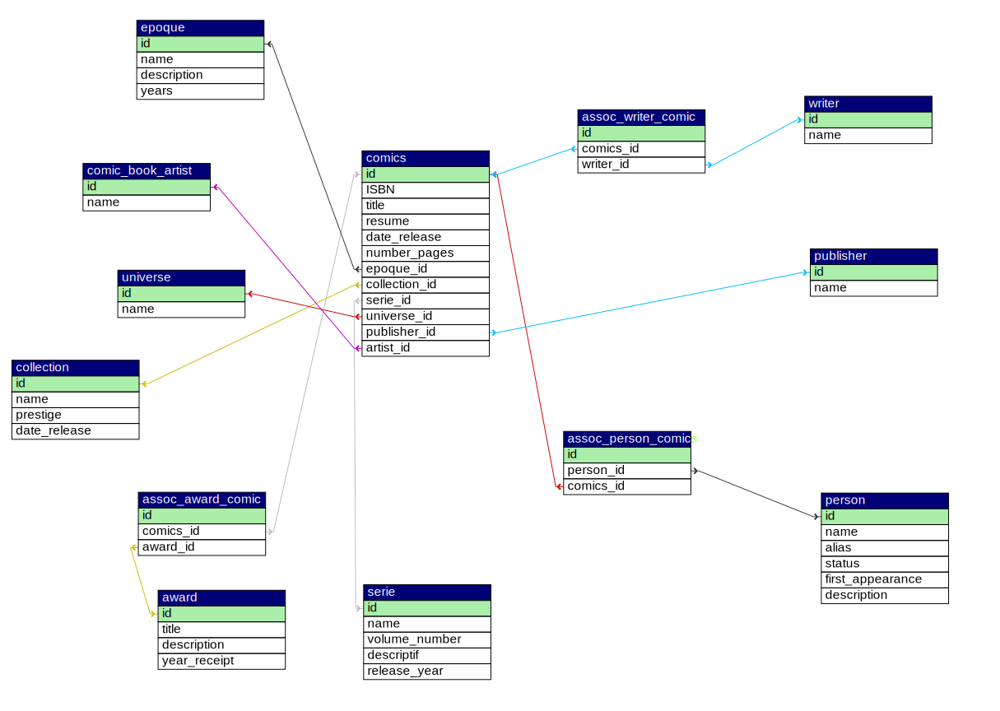

## Exercice 

``En utilisant les informations du MCD. Vous devez procéder aux corrections qui vous semblent nécessaires. Puis créer la base de données sous MySQL (voir mcd_comics.png) ``

## Table Comics :

Un comics a un ISBN unique, et est stocké en varchar car je le considère comme une chaine de caractère de chiffres de longueur 13. 
Il a un titre, un résumé et une date de parution. 

### Relation 1-to-Many : 

- un comics appartient à UNE époque 
- un comics peut appartenir à UNE collection 
- un comics peut appartient à UNE série (hors série d'où le peut) 
- un comics appartient à UN univers
- un comics est publié par UN éditeur 
- un comics est dessiné par UN dessinateur (source : google)

### Relation Many-To-Many:

- un comics est écrit par UN ou PLUSIEURS éditeurs
- un comics possède UN ou PLUSIEURS personnages
- un comics possède ZERO ou PLUSIEURS récompenses
- un comics peut être écrit par plusieurs scénaristes 

## Général : 

Les champs "description/descriptif" ont été modifiés en type "TEXT"

## Schema 

